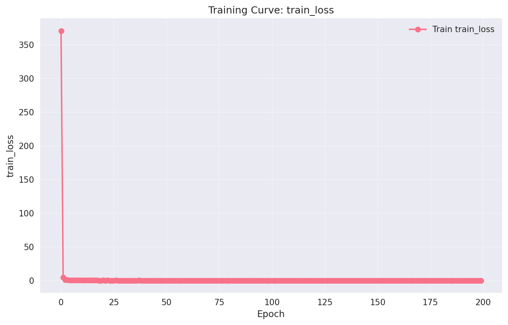
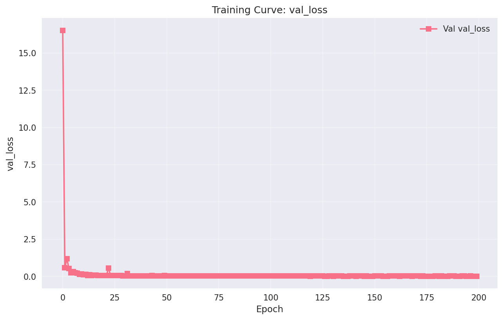
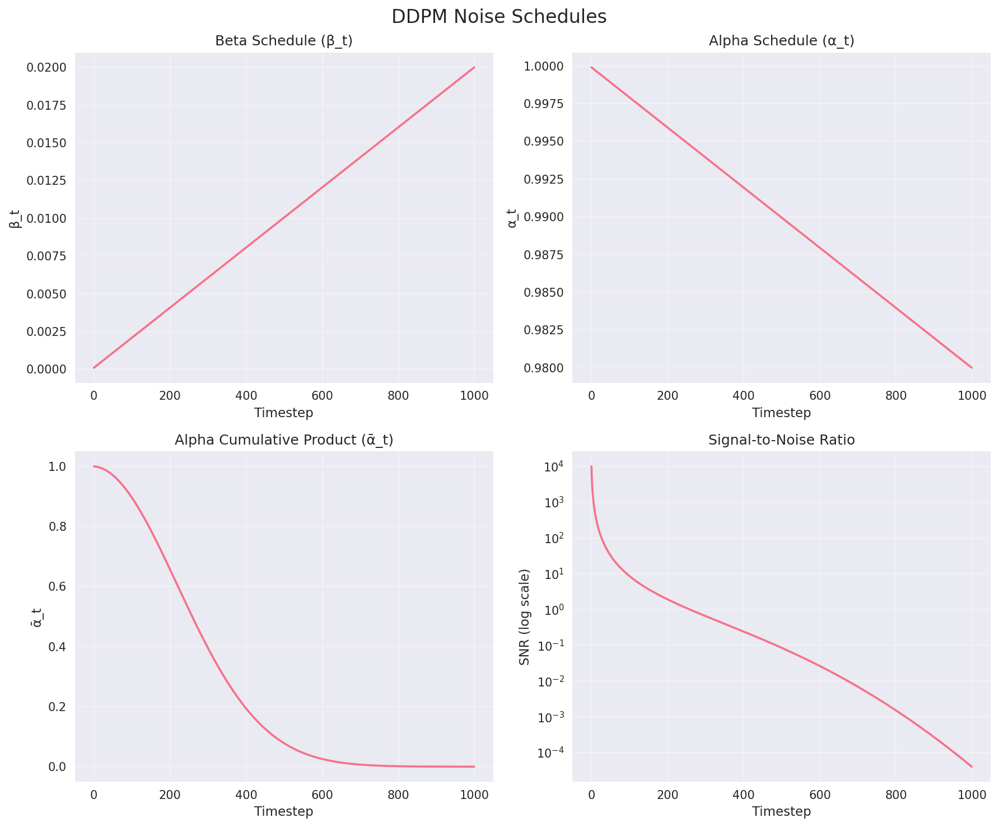
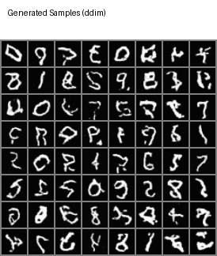

# DDPM Training Report

**Generated on:** Sun 24 Aug 2025 03:35:27 PM CST  
**Config:** `mnist.yaml`  
**Model:** DDPM with UNet backbone

## Training Overview

This report summarizes the training and evaluation of a Denoising Diffusion Probabilistic Model (DDPM).

### Configuration Summary

- **Dataset:** "mnist"
- **Image Size:** 32#Resizeto32x32forconsistency
- **Timesteps:** 1000
- **Schedule:** "linear"#"linear"or"cosine"
- **Model Channels:** 32#Basenumberofchannels

## Results

### Training Curves






### Noise Schedules



### Generated Samples



### Reverse Diffusion Process


## Evaluation Metrics

Evaluation metrics:

```json
{
  "ddim_50steps": {
    "lpips_diversity": 0.09361821180209517,
    "pixel_diversity": 0.34047865867614746
  },
  "calibration": {
    "timesteps": [
      0,
      111,
      222,
      333,
      444,
      555,
      666,
      777,
      888,
      999
    ],
    "mse": [
      0.28144953213632107,
      0.038997002141550184,
      0.026960796462371945,
      0.020087096188217402,
      0.014219498471356928,
      0.007657712011132389,
      0.0023239880555775017,
      0.0005230542350909673,
      0.00012592900806339456,
      6.481795371655607e-05
    ],
    "psnr": [
      52.03175926208496,
      28.797238178253174,
      23.81034502029419,
      20.145837421417237,
      16.80178322792053,
      14.039913501739502,
      13.013586149215698,
      12.45331386566162,
      10.916597442626953,
      7.801564230918884
    ]
  }
}```


## Model Details

### Architecture
- UNet-based denoising network
- Time-conditional FiLM layers
- Multi-head self-attention
- Exponential Moving Average (EMA)

### Training Details
- Mixed precision training (AMP)
- Gradient clipping
- Cosine learning rate schedule
- Periodic sampling during training

## Files Generated

### Checkpoints
- `ckpts/best.pt` - Best validation loss checkpoint
- `ckpts/latest.pt` - Latest training checkpoint  
- `ckpts/ema.pt` - EMA weights (used for sampling)

### Visualizations
- `grids/` - Sample image grids
- `animations/` - Reverse process animations
- `curves/` - Training and schedule plots

### Logs
- `logs/training_metrics.json` - Training history
- `logs/evaluation_results.json` - Evaluation metrics

## Usage Examples

```bash
# Generate more samples
python -m src.cli sample.grid --config /home/chrislin/Generative-Model-is-Every-Thing-You-Must-Learn/Day_06_Full_DDPM_Training_Loop/configs/mnist.yaml --num_samples 100

# Create custom animation
python -m src.cli sample.traj --config /home/chrislin/Generative-Model-is-Every-Thing-You-Must-Learn/Day_06_Full_DDPM_Training_Loop/configs/mnist.yaml --method ddim --num_steps 20

# Run evaluation
python -m src.cli eval --config /home/chrislin/Generative-Model-is-Every-Thing-You-Must-Learn/Day_06_Full_DDPM_Training_Loop/configs/mnist.yaml --all_methods

# Plot training curves
python -m src.cli viz.curves --log_dir outputs/logs
```

---

*Report generated by DDPM Day 6 training pipeline*
